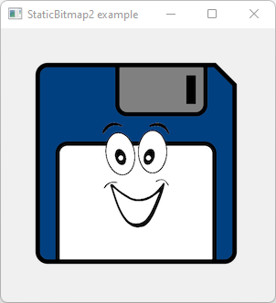

# StaticBitmap2

Shows how to create a StaticBitmap widget with wxStaticBitmap.

## Source

[StaticBitmap2.cpp](StaticBitmap2.cpp)

[CMakeLists.txt](CMakeLists.txt)

[Resources/Logo.png](Resources/Logo.png)

## Output



## Build and run

To build this project, open "Terminal" and type following lines:

### Windows :

``` shell
mkdir build && cd build
cmake .. 
start StaticBitmap2.sln
```

Select StaticBitmap2 project and type Ctrl+F5 to build and run it.

### macOS :

``` shell
mkdir build && cd build
cmake .. -G "Xcode"
open ./StaticBitmap2.xcodeproj
```

Select StaticBitmap2 project and type Cmd+R to build and run it.

### Linux with Code::Blocks :

``` shell
mkdir build && cd build
cmake .. -G "CodeBlocks - Unix Makefiles"
xdg-open ./StaticBitmap2.cbp > /dev/null 2>&1
```

Select StaticBitmap2 project and type F9 to build and run it.

### Linux :

``` shell
mkdir build && cd build
cmake .. 
cmake --build . --config Debug
./StaticBitmap2
```
