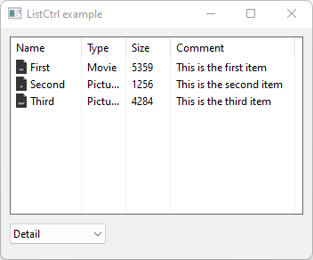

# ListCtrl

Shows how to create a ActivityIndicator widget with wxListCtrl.

## Source

[Ai16.xpm](Ai16.xpm)

[Ai48.xpm](Ai48.xpm)

[Avi16.xpm](Avi16.xpm)

[Avi48.xpm](Avi48.xpm)

[Bmp16.xpm](Bmp16.xpm)

[Bmp48.xpm](Bmp48.xpm)

[ListCtrl.cpp](ListCtrl.cpp)

[CMakeLists.txt](CMakeLists.txt)

## Output



## Build and run

To build this project, open "Terminal" and type following lines:

### Windows :

``` shell
mkdir build && cd build
cmake .. 
start ListCtrl.sln
```

Select ListCtrl project and type Ctrl+F5 to build and run it.

### macOS :

``` shell
mkdir build && cd build
cmake .. -G "Xcode"
open ./ListCtrl.xcodeproj
```

Select ListCtrl project and type Cmd+R to build and run it.

### Linux with Code::Blocks :

``` shell
mkdir build && cd build
cmake .. -G "CodeBlocks - Unix Makefiles"
xdg-open ./ListCtrl.cbp > /dev/null 2>&1
```

Select ListCtrl project and type F9 to build and run it.

### Linux :

``` shell
mkdir build && cd build
cmake .. 
cmake --build . --config Debug
./ListCtrl
```
