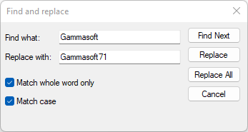

# FindReplaceDialog

Shows how to create a FindReplaceDialog dialog with wxFindReplaceDialog.

## Source

[FindReplaceDialog.cpp](FindReplaceDialog.cpp)

[CMakeLists.txt](CMakeLists.txt)

## Output



## Build and run

To build this project, open "Terminal" and type following lines:

### Windows :

``` shell
mkdir build && cd build
cmake .. 
start FindReplaceDialog.sln
```

Select FindReplaceDialog project and type Ctrl+F5 to build and run it.

### macOS :

``` shell
mkdir build && cd build
cmake .. -G "Xcode"
open ./FindReplaceDialog.xcodeproj
```

Select FindReplaceDialog project and type Cmd+R to build and run it.

### Linux with Code::Blocks :

``` shell
mkdir build && cd build
cmake .. -G "CodeBlocks - Unix Makefiles"
xdg-open ./FindReplaceDialog.cbp > /dev/null 2>&1
```

Select FindReplaceDialog project and type F9 to build and run it.

### Linux :

``` shell
mkdir build && cd build
cmake .. 
cmake --build . --config Debug
./FindReplaceDialog
```
