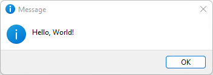

# HelloWorldMessageDialog2

The classic first application "Hello World" with wxMessageDialog.

## Source

[HelloWorldMessageDialog2.cpp](HelloWorldMessageDialog2.cpp)

[CMakeLists.txt](CMakeLists.txt)

## Output



## Build and run

To build this project, open "Terminal" and type following lines:

### Windows :

``` shell
mkdir build && cd build
cmake .. 
start HelloWorldMessageDialog2.sln
```

Select HelloWorldMessageDialog2 project and type Ctrl+F5 to build and run it.

### macOS :

``` shell
mkdir build && cd build
cmake .. -G "Xcode"
open ./HelloWorldMessageDialog2.xcodeproj
```

Select HelloWorldMessageDialog2 project and type Cmd+R to build and run it.

### Linux with Code::Blocks :

``` shell
mkdir build && cd build
cmake .. -G "CodeBlocks - Unix Makefiles"
xdg-open ./HelloWorldMessageDialog2.cbp > /dev/null 2>&1
```

Select HelloWorldMessageDialog2 project and type F9 to build and run it.

### Linux :

``` shell
mkdir build && cd build
cmake .. 
cmake --build . --config Debug
./HelloWorldMessageDialog2
```
